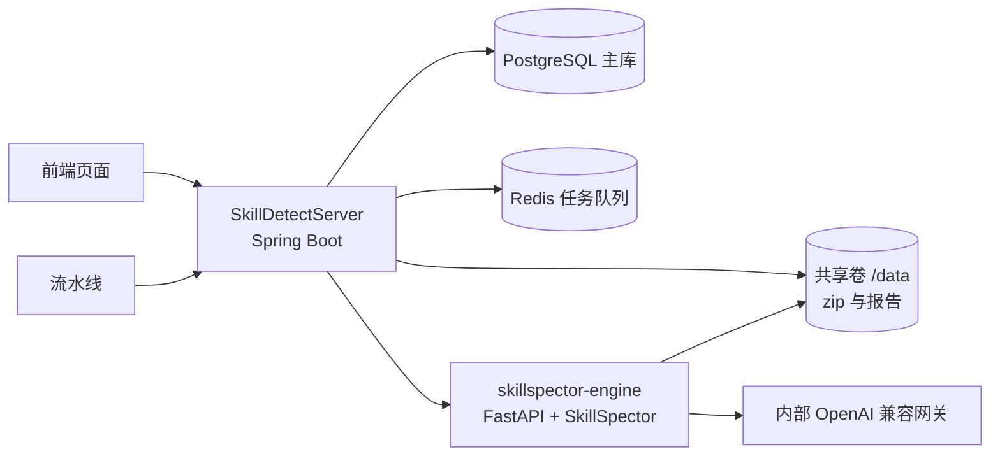

# Skill 投毒安全检测服务

基于开源项目 [SkillSpector](https://github.com/NVIDIA/skillspector)（检测引擎）与 Spring Boot
`SkillDetectServer`（编排/控制面）实现的 **AI Agent Skill 投毒安全检测后端**，对外提供三类接口：

- **HMI** `/api/v1`：面向前端页面（SSO，当前未启用）
- **M2M** `/api/m2m/v1`：面向流水线（API Key，当前未启用），异步 + 轮询 + SARIF
- **健康** `/healthz`、`/readyz`、`/api/v1/engine/health`

## 架构



- PostgreSQL 是任务/发现项/基线/凭据的**事实来源**；Redis 是**任务队列**（P0 用 List，P1 可选 Stream）。
- 引擎独立部署，Server 通过 HTTP 同步调用 `POST /v1/scan`，`max-active` 控制有界并发（默认 8）。
- 上传 zip 落共享卷 `/data/<taskNo>/input.zip`，引擎直接扫描该路径（SkillSpector 支持 zip）。

## 目录结构

```
.
├── docker-compose.yml          # 一键编排 engine/server/postgres/redis + 共享卷
├── .env / .env.example         # LLM 网关配置（需填写）
├── SkillDetectServer/          # Spring Boot 控制面
│   ├── src/main/java/com/skilldetect/server/
│   ├── src/main/resources/application.yml
│   └── docs/{openapi.yaml, schema.sql, redis-queue-contract.md, auth-design.md}
├── skillspector-engine/        # 引擎薄封装（FastAPI 包 SkillSpector）
│   ├── app.py / Dockerfile / requirements.txt
│   └── fixtures/healthy_skill/
└── docs/                       # 项目级文档
    ├── architecture.md
    ├── implementation.md
    └── development.md
```

## 快速开始

### 前置条件

- Docker（推荐 OrbStack，当前开发环境使用）
- 已填写 `.env` 中的 LLM 网关配置（仅静态扫描可不填）

### 启动

```bash
# 1. 配置 LLM（可选，静态扫描可跳过）
cp .env.example .env   # 然后填写 OPENAI_BASE_URL / OPENAI_API_KEY / SKILLSPECTOR_MODEL

# 2. 构建并启动全部服务
docker compose up --build -d

# 3. 查看状态
docker compose ps
curl http://localhost:8080/healthz
curl http://localhost:8080/readyz
curl http://localhost:8080/api/v1/engine/health
```

### 冒烟测试

```bash
# 准备一个良性 skill zip
mkdir -p /tmp/skill-test && printf -- '---\nname: demo\ndescription: demo\n---\n# demo\n' > /tmp/skill-test/SKILL.md
(cd /tmp/skill-test && zip -r ../skill-test.zip .)

# HMI 静态扫描
curl -F "file=@/tmp/skill-test.zip" -F "useLlm=false" http://localhost:8080/api/v1/scans
curl http://localhost:8080/api/v1/scans/<taskId>

# M2M SARIF 扫描
curl -F "file=@/tmp/skill-test.zip" -F "useLlm=false" -F 'metadata={"repo":"x"}' http://localhost:8080/api/m2m/v1/scans
curl http://localhost:8080/api/m2m/v1/scans/<taskId>/report/sarif
```

## 主要接口

完整定义见 [`SkillDetectServer/docs/openapi.yaml`](SkillDetectServer/docs/openapi.yaml)。

| 组 | 方法 | 路径 | 说明 |
|---|---|---|---|
| HMI | POST | `/api/v1/scans` | 上传 zip 创建扫描 |
| HMI | GET | `/api/v1/scans/{taskId}` | 任务状态/结论 |
| HMI | GET | `/api/v1/scans/{taskId}/report?format=json\|markdown` | 报告 |
| HMI | GET | `/api/v1/scans/{taskId}/findings` | 发现项分页 |
| HMI | GET | `/api/v1/rules` | 规则目录（17 类 / 72 条） |
| HMI | POST/GET | `/api/v1/baselines` | 基线管理（误报抑制） |
| M2M | POST | `/api/m2m/v1/scans` | 上传 zip 创建扫描 |
| M2M | GET | `/api/m2m/v1/scans/{taskId}` | 轮询结果 |
| M2M | GET | `/api/m2m/v1/scans/{taskId}/report/sarif` | 下载 SARIF |
| M2M | POST | `/api/m2m/v1/scans/{taskId}/retry` | 重试（FAILED/CANCELED） |
| M2M | POST | `/api/m2m/v1/scans/{taskId}/cancel` | 取消 |
| 健康 | GET | `/healthz` `/readyz` `/api/v1/engine/health` | 存活/就绪/引擎详情 |
| 监控 | GET | `/actuator/prometheus` | Prometheus 指标 |

## 关键配置

见 `SkillDetectServer/src/main/resources/application.yml`（Spring 配置）与 `.env`（LLM 网关）。

| 配置 | 默认 | 说明 |
|---|---|---|
| `scan.risk-threshold` | 50 | 可配置门禁阈值（请求级可覆盖） |
| `scan.concurrency.max-active` | 8 | 真正同时扫描的引擎并发数 |
| `scan.engine.timeout-seconds` | 720 | 引擎调用超时（>10min 单次上限） |
| `scan.retention-days` | 30 | 终态任务留存天数 |
| `scan.engine.circuit-failure-threshold` | 5 | 熔断连续失败阈值 |
| `scan.engine.circuit-open-seconds` | 60 | 熔断开路时长 |
| `rate-limit.enabled` | true | 限流开关 |
| `rate-limit.hmi/m2m-requests-per-minute` | 120 / 60 | 每 IP 每分钟限流 |
| `security.enabled` | false | 鉴权开关（设计见 auth-design.md） |

## 文档

- [架构设计](docs/architecture.md)
- [实现说明](docs/implementation.md)
- [二次开发指南](docs/development.md)
- [OpenAPI](SkillDetectServer/docs/openapi.yaml)
- [数据库 DDL](SkillDetectServer/docs/schema.sql)
- [Redis 队列契约](SkillDetectServer/docs/redis-queue-contract.md)
- [鉴权设计](SkillDetectServer/docs/auth-design.md)

## 许可证说明

本项目编排层代码供内部使用；检测引擎依赖 [SkillSpector](https://github.com/NVIDIA/skillspector)
（Apache-2.0），使用前请阅读其 `LICENSE` 与 `THIRD_PARTY_NOTICES.md`。
