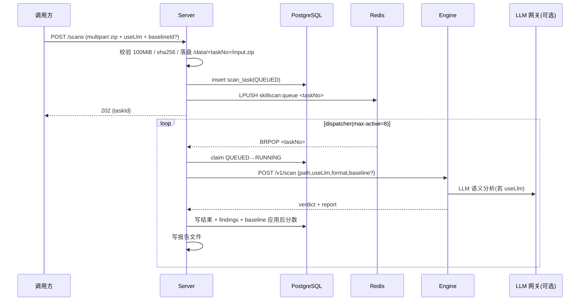

# 架构设计

## 1. 总体架构

```
┌────────────────────────────────────────────────────────────────┐
│  调用方                                                            │
│  前端页面(HMI)        流水线/CI(M2M)        运维/健康探测          │
└──────────┬──────────────────┬─────────────────────┬─────────────┘
           │ /api/v1          │ /api/m2m/v1          │ /healthz /readyz
           ▼                  ▼                     ▼
┌────────────────────────────────────────────────────────────────┐
│  SkillDetectServer（Spring Boot 控制面）                         │
│  REST API · 鉴权(预留) · 限流 · 熔断 · 任务编排 · 持久化          │
└──────┬──────────────┬────────────────┬──────────────┬──────────┘
       │ JDBC         │ Redis(List)    │ 共享卷 /data │ HTTP(同步)
       ▼              ▼                ▼              ▼
┌──────────────┐ ┌────────────┐ ┌──────────────┐ ┌──────────────────┐
│ PostgreSQL   │ │ Redis      │ │ 共享卷 /data │ │ skillspector-engine│
│ 主库(事实来源)│ │ 任务队列    │ │ zip / 报告   │ │ FastAPI + SkillSpector│
└──────────────┘ └────────────┘ └──────────────┘ └────────┬─────────┘
                                                          │ LLM 调用
                                                          ▼
                                             内部 OpenAI 兼容网关
```

**职责边界**

- `SkillDetectServer`：对外 API、任务编排、状态机、持久化、文件存储、结果/报告、限流/熔断/监控、健康聚合。
- `skillspector-engine`：仅负责“检测”，调用 SkillSpector 图，返回结构化 verdict；无业务状态，可独立扩缩容/升级。
- PostgreSQL：`scan_task` / `scan_finding` / `scan_baseline` / `api_credential`(预留) / `engine_health_log` 的事实来源。
- Redis：任务队列 + 取消标记 + 限流计数；可重建、不承载持久数据。

## 2. 关键设计决策

| 决策点 | 结论 | 理由 |
|---|---|---|
| 引擎集成 | FastAPI 薄封装 `run_scan` / `graph.ainvoke` | 复用测试过的核心，健康检查自然，可横向扩展 |
| 引擎调用 | 同步 `POST /v1/scan`（长连接） | MVP 简单；后续可切 submit+poll（已预留任务登记） |
| 队列 | Redis List `LPUSH/BRPOP` | 单消费者够用；P1 可选 Stream（ack/重投） |
| 并发 | `max-active` 个 worker 线程（默认 8） | 100 在途 = 队列容量；8 = 真正同时扫描 |
| 事实来源 | PostgreSQL | 丢队列不丢任务，可对账重建 |
| 门禁判定 | Server 用 `riskThreshold` 重算 `pass` | 引擎阈值固定 50，业务阈值可配置 |
| 鉴权 | 后置、开关化 | `security.enabled=false`，接口/数据模型已预留 |
| 部署 | 单机 Docker Compose | 目标环境；可迁移 K8s |

## 3. 任务状态机

```
PENDING → QUEUED → RUNNING → SUCCEEDED
                    │           └─ FAILED
                    │           └─ CANCELED（排队/运行中可取消）
```

- 创建：落库 `QUEUED`（提交后）→ 入队。
- 派发：worker `BRPOP` → 原子抢占 `QUEUED→RUNNING` → 调引擎。
- 完成：`SUCCEEDED`（写结果+发现项+报告）或 `FAILED`（写错误）。
- 自愈：启动/周期把“QUEUED 但不在队列”的任务补入队；超时 `RUNNING` 置 `FAILED(TIMEOUT)`。

## 4. 数据流（一次扫描）



## 5. 引擎 verdict 结构

`POST /v1/scan` 返回核心字段：

- `risk_score`（0-100）、`severity`、`recommendation`、`safe_to_install`
- `execution_successful`、`analysis_completeness`（`is_complete` / `entirely_uninspected_files`）
- `findings`（发现项数组，含 `id`=rule_id、`location`、`severity`、`explanation` 等）
- `report`（按 `output_format` 渲染：json/sarif/markdown）
- `llm_requested` / `llm_available` / `llm_used` / `scan_mode`（诚实呈现 LLM 是否真正执行）

## 6. 可扩展性 / 可靠性

- 引擎可横向多副本；Server 用 `max-active` 限流，后续多实例时 `skillscan:active`（INCR/DECR）做全局并发。
- 引擎重启：PostgreSQL 事实来源 + 启动对账补队列，不丢任务。
- 长任务：引擎调用超时 12min + 周期超时兜底。
- 熔断：引擎连续失败达到阈值即开路，半开探活恢复。
- 限流：Redis 固定窗口按 IP 区分 HMI/M2M。
