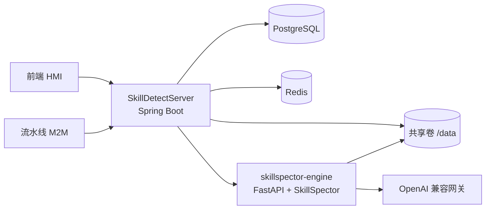
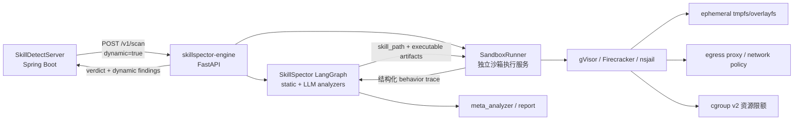

# Skill 投毒检测能力范围与沙箱动态执行演进方案

> 文档状态：分析 / 规划稿
> 最后更新：2026-08-28
> 说明：本文档仅记录当前项目能力边界与后续演进方向，不代表已完成实现。落盘时不涉及任何功能代码修改。

## 摘要

当前项目是一套基于开源 SkillSpector 检测引擎与 Spring Boot 编排层的 Agent Skill 投毒检测后端，检测能力本质为：

- **静态检测为主**：正则/YAML/JSON 规则、Python AST、taint 数据流、YARA 签名、依赖与 OSV、MCP 清单分析；
- **可选 LLM 语义分析为辅**：语义意图、开发者意图、质量策略与 meta 过滤。

当前系统**没有真正的沙箱动态执行检测**。`skillspector-engine/app.py` 的 `scan_mode` 只有 `static-only` 与 `static+llm` 两种取值。

对于 Agent 领域“供应链投毒”，当前项目已具备**部分静态/制品/依赖/语义层检测能力**，覆盖 MCP rug-pull、MCP tool poisoning、依赖漏洞、typosquatting、混淆执行、字节码与隐藏可执行文件等场景，但缺少运行时行为验证、真实依赖安装/构建验证、密码学签名验证与 MCP server 实际拉起验证。

后续若新增沙箱动态执行检测，架构上“增加一个分析节点”相对容易，但“安全、可信、可编排、可复现地执行不可信代码”属于一个新的基础设施子系统，是主要工程难点。

---

## 1. 当前项目能力范围

### 1.1 总体架构



- 控制面：`SkillDetectServer/`，负责 API、任务编排、状态机、持久化、限流、熔断与健康检查。
- 检测引擎：`SkillSpector/`，负责实际扫描并输出 verdict。
- 薄封装：`skillspector-engine/`，通过 `POST /v1/scan` 对 SkillSpector 图进行同步调用。
- 事实来源：PostgreSQL；任务队列：Redis；文件交换：共享卷 `/data`。

### 1.2 SkillSpector 检测流水线

`SkillSpector/src/skillspector/graph.py` 的主流程为：

```text
resolve_input
  -> build_context
  -> [全部 analyzer 并行 fan-out]
  -> meta_analyzer
  -> finalize_inspection_ledger
  -> report
```

分析器通过 `SkillSpector/src/skillspector/nodes/analyzers/__init__.py` 自动发现并注册，新增分析节点通常不需要修改 `graph.py` 的主干边。

### 1.3 检测手段分类

| 阶段 | 能力 | 关键实现 |
|---|---|---|
| 静态模式匹配 | Prompt Injection、Data Exfiltration、Privilege Escalation、Supply Chain、Excessive Agency、Output Handling、System Prompt Leakage、Memory Poisoning、Tool Misuse、Rogue Agent、Trigger Abuse、Anti-Refusal、SSRF、Insecure Deserialization 等 | `nodes/analyzers/static_patterns_*.py` |
| 代码行为静态分析 | Python AST 危险调用、taint 数据流 | `nodes/analyzers/behavioral_ast.py`、`nodes/analyzers/behavioral_taint_tracking.py` |
| 恶意签名 | webshell、cryptominer、malware、hacktool | `nodes/analyzers/static_yara.py` |
| 依赖/漏洞情报 | OSV.dev 实时漏洞查询与离线回退 | `nodes/analyzers/static_patterns_supply_chain.py`、`nodes/analyzers/osv_client.py` |
| MCP 风险 | MCP least privilege、tool poisoning、rug pull | `nodes/analyzers/mcp_least_privilege.py`、`mcp_tool_poisoning.py`、`mcp_rug_pull.py` |
| 制品完整性 | 扩展名/内容不一致、Unicode 混淆、NUL、分析规避 | `nodes/analyzers/artifact_integrity.py` |
| 嵌套制品 | 不执行、不渲染地检查 zip/docx/xlsx/pptx 内可执行内容 | `nested_artifacts.py` |
| 引用与传递来源 | 本地引用、外部引用解析与受限传递追踪 | `references.py`、`transitive.py` |
| LLM 语义分析 | SSD、SDI、SQP 与 meta 过滤/解释 | `semantic_security_discovery.py`、`semantic_developer_intent.py`、`semantic_quality_policy.py`、`meta_analyzer.py` |

### 1.4 当前扫描模式

`skillspector-engine/app.py` 在 `_run_scan` 中明确：

```text
scan_mode = "static+llm" if llm_used else "static-only"
```

因此当前没有 `dynamic` / `sandbox` 模式。

---

## 2. Agent 供应链投毒检测能力与边界

### 2.1 已有覆盖

#### 传统供应链风险

`SkillSpector/src/skillspector/nodes/analyzers/static_patterns_supply_chain.py`

| 规则 | 覆盖内容 |
|---|---|
| SC1 | 依赖未固定版本 |
| SC2 | 远程下载并执行脚本 |
| SC3 | base64/hex/marshal/compile 等混淆执行 |
| SC4 | 已知漏洞依赖，OSV.dev 实时查询，离线回退 |
| SC5 | 已废弃/停维护依赖 |
| SC6 | typosquatting 包名检测 |
| SC7 | 不可信容器镜像与签名/校验绕过 |
| SC8 | 随包携带 `__pycache__` / `.pyc` / `.pyo` |
| SC9 | 隐藏在文档或隐藏文件中的可执行文件 |

#### MCP / Agent 工具供应链风险

- `mcp_rug_pull.py`
  - RP1：未固定版本的 `npx` / `uvx` / `pip install` / `docker pull/run` 等外部 MCP server 引用；
  - RP2/RP3：manifest 权限、trigger、parameter 变更，识别权限扩张型 rug-pull。
- `mcp_tool_poisoning.py`
  - TP1：隐藏指令、HTML/Markdown 注释、零宽字符、base64、data URI；
  - TP2：Cyrillic/Greek 混淆字符；
  - TP3：恶意参数描述；
  - TP4：工具实现代码的 LLM 语义审查。
- `mcp_least_privilege.py`
  - LP1–LP4：权限声明与代码实际能力不匹配、通配权限、未声明权限等。

#### 行为与恶意代码

- `behavioral_ast.py`：AST1–AST10，检测 `exec/eval/compile/__import__/subprocess/os.system/getattr`、危险执行链与不安全反序列化。
- `behavioral_taint_tracking.py`：TT1–TT6，检测 `环境变量/文件读取/外部输入 -> 网络输出/命令执行/文件写入` 的数据流。
- `static_yara.py`：YR1–YR4，恶意样本签名。
- `artifact_integrity.py`：AE 系列，制品层分析规避信号。

#### 输入与制品层

- `input_handler.py` 支持目录、zip、文件、Git URL、file URL，并带有体积、成员数、SSRF 主机与 zip-slip 防护。
- `nested_artifacts.py` 支持嵌套 zip 检查，但明确**不执行、不渲染、不导入**内部内容。
- `references.py` 与 `transitive.py` 提供本地/外部引用解析与受限传递追踪。
- `build_context.py` 可识别 `skill.oms.sig`，但目前仅做结构识别，不执行密码学验签。

### 2.2 当前边界与不足

1. **无运行时验证**
   - 无法确认 skill/MCP server 被加载后是否会真实出网、读取凭据、派生进程或写入文件。
   - 对运行时解码 payload、沙箱感知恶意代码、多阶段下载器的检测能力有限。

2. **不执行依赖安装与构建**
   - 仅解析 `requirements.txt`、`package.json`、`pyproject.toml` 等清单；
   - 不真实安装依赖，不执行 `setup.py` / `npm install` / `pip install`，也不验证 lockfile 与声明的一致性。

3. **没有真实签名验证**
   - OMS 签名目前只是识别并排除出扫描范围，未做内容级密码学验证。

4. **MCP server 不实际拉起**
   - 当前通过正则、清单与 LLM 分析 MCP 配置，不启动真实 MCP server 观察运行时行为。

5. **自然语言指令型攻击无法“执行”**
   - SKILL.md 中的提示注入本质是自然语言问题，动态执行只适合可运行脚本、工具定义与命令制品。

6. **规则目录与实际引擎存在偏差**
   - `SkillDetectServer/src/main/resources/rules.json` 当前暴露 17 类 / 72 条静态规则，未包含部分引擎实际存在的规则，例如 MCP rug-pull、artifact-integrity 与语义类规则。
   - 该文件需要后续统一，否则对外规则目录不能完整反映真实能力。

---

## 3. 沙箱动态执行能力演进方案

### 3.1 目标与原则

新增动态执行检测的目标是：在“不信任被测代码”的前提下，观察并记录 skill 中可执行制品的真实行为，将行为证据接入现有 `Finding -> SARIF -> risk_score` 体系。

核心原则：

1. 不可信代码永不进入 Engine 进程空间；
2. SandboxRunner 只返回结构化行为事件，不返回任意文件或任意输出；
3. 默认无网络，网络能力必须显式开启且经过 egress 代理；
4. 所有资源限额触发都必须 fail-closed 并写入 analysis completeness；
5. 执行结果可复现：固定环境、固定超时、记录环境摘要。

### 3.2 目标架构



### 3.3 新增组件：SandboxRunner

建议新增独立服务 `sandbox-runner/`，不与 `skillspector-engine` 同进程执行不可信代码。

#### 职责

1. 接收执行任务：
   - 制品路径或内容哈希；
   - 语言/harness：`python` / `bash` / `node` / `mcp` 等；
   - 入口命令；
   - CPU/内存/磁盘/网络/进程数/超时限额；
   - 网络策略；
   - 环境变量 allowlist。

2. 在隔离环境中运行：
   - 默认非 root；
   - 只读根文件系统 + 可写 tmpfs/overlay 工作区；
   - 禁止访问宿主机 `/data`、Docker socket、云 metadata 与内网网段；
   - seccomp/AppArmor/namespace 限制。

3. 采集结构化行为证据：
   - 进程树：`execve`、`fork`、`clone`；
   - 文件：敏感路径读写、`.ssh`、`.aws`、`.env`；
   - 网络：`connect`、`sendto`、DNS、SNI、目标 IP/端口、发送字节；
   - 执行链：动态 import、解码后执行、命令执行；
   - 资源使用：CPU、内存、磁盘写入、进程数、运行时长。

#### 隔离运行时选型

| 方案 | 隔离强度 | 实施成本 | 适用阶段 |
|---|---|---|---|
| `nsjail` / `bubblewrap` + seccomp | 中 | 低 | MVP、单机、内部实验 |
| `gVisor runsc` + Docker/containerd | 中高 | 中 | 推荐生产基线 |
| Firecracker / Kata microVM | 高 | 高 | 多租户、强隔离 |

建议路线：先用 gVisor 或 nsjail 打通链路，再按多租户要求升级 Firecracker/Kata。

### 3.4 SkillSpector 引擎改造

#### 新增动态分析节点

利用现有分析器自动发现机制，新增：

```text
nodes/analyzers/sandbox_dynamic_execution.py
```

该节点负责：

- 读取 `state["skill_path"]`、`component_metadata`、`has_executable_scripts`；
- 根据 `execution_policy` 选择可执行制品；
- 调用 SandboxRunner；
- 将行为 trace 映射为 `Finding`。

同时扩展：

- `SkillspectorState` 增加动态执行配置、trace 与结果字段；
- `AnalyzerNodeResponse` 增加动态结果字段；
- 保持动态执行与静态/LLM 阶段解耦。

#### 新增动态规则族

建议定义 `DY-*` 规则：

| 规则 ID | 行为 |
|---|---|
| DY1 | 未声明的外部网络连接 |
| DY2 | 读取敏感凭据文件 |
| DY3 | 派生 shell/子进程执行命令 |
| DY4 | 运行时解码后再执行 |
| DY5 | 向工作区外写入文件 |
| DY6 | 访问云 metadata / 内网地址 |
| DY7 | 沙箱感知或反检测行为 |
| DY8 | 异常资源滥用 / 进程树异常 |

新规则需同步到：

- `nodes/analyzers/pattern_defaults.py`；
- `SkillDetectServer/src/main/resources/rules.json`。

#### 扩展资源预算

`SkillSpector/src/skillspector/state.py` 当前只有 `max_seconds / max_bytes / max_artifacts`，需新增：

- CPU 时间；
- 内存峰值；
- 磁盘写入量；
- 网络连接数与出站字节；
- 进程树深度 / 进程数；
- 单制品执行超时；
- 总动态分析预算。

所有限额触发都写入 `inspection_ledger`，并体现在 `analysis_completeness` 中，不能静默当成“无问题”。

### 3.5 `skillspector-engine` API 改造

当前 `POST /v1/scan` 请求为 `path / use_llm / output_format / baseline`，建议扩展：

```jsonc
{
  "path": "/data/.../input.zip",
  "use_llm": true,
  "dynamic": true,
  "dynamic_profile": "python-bash-no-network",
  "output_format": "sarif",
  "baseline": null
}
```

新增返回字段：

- `dynamic_used`
- `dynamic_complete`
- `dynamic_findings`
- `sandbox_limitations`
- `sandbox_environment_digest`

新增健康检查：

- `GET /health/sandbox`：runner 可用性、运行时类型、能力矩阵。

### 3.6 SkillDetectServer 控制面改造

涉及：

- `EngineClient.java`
- `EngineScanResponse.java`
- `ScanExecutionService.java`
- `ScanTaskEntity.java`
- `ScanFindingEntity.java`
- `SkillDetectServer/docs/schema.sql`
- `SkillDetectServer/docs/openapi.yaml`

改造方向：

1. 扫描请求增加 `dynamic` / `dynamicProfile`；
2. `EngineScanResponse` 解析动态字段；
3. 新增或扩展动态证据存储；
4. `safe_to_install` 纳入 `dynamic_complete` 与动态风险；
5. 规则目录补充 DY 规则；
6. OpenAPI 同步更新。

若后续引入“真实安装依赖”或“拉起 MCP server”，建议从同步长连接演进为 submit + poll。

### 3.7 部署与网络隔离

当前 `docker-compose.yml` 仅包含 `engine / server / postgres / redis`，建议新增：

- `sandbox-runner` 服务；
- `sandbox-net` 隔离网络；
- 沙箱输入不挂载 `skill-data`，或仅通过受控 artifact API 拉取。

网络策略：

- Engine 与 SandboxRunner 之间使用内部 API，建议 token/mTLS；
- 沙箱容器默认无网络，或仅允许访问受控 egress proxy；
- 沙箱不能访问 PostgreSQL、Redis、Server 内部端口；
- 宿主 `/data` 对沙箱不可见。

### 3.8 可复现性设计

1. 固定运行环境：
   - 固定 base image 与 harness 版本；
   - 记录 `sandbox_environment_digest` 到报告。
2. 默认无网络：
   - 仅显式开启 `install-deps` 或 `mcp-verify` 等 profile 时允许受限出网。
3. 固定资源与超时：
   - 同一 skill 使用相同 CPU/内存/磁盘/网络/超时配额。
4. 证据绑定：
   - 动态 Finding fingerprint 包含 `rule_id + 行为签名 + 环境摘要`。
5. 输出确定性：
   - 不将 stdout/stderr 直接作为结论，只使用结构化 syscall/事件。

---

## 4. 改动代价评估

### 4.1 工程改动量

| 模块 | 相对工作量 | 风险 | 说明 |
|---|---|---|---|
| SandboxRunner 运行与采集 | 40%–50% | 高 | 隔离、syscall/网络采集、资源限制、防逃逸 |
| SkillSpector 动态节点/state/report | 15%–20% | 中 | 规则映射、预算扩展、风险评分 |
| Engine wrapper API | 5%–10% | 低 | 请求/响应扩展、健康检查 |
| SkillDetectServer 控制面 | 10%–15% | 中 | API/DB/门禁/报告 |
| 部署与网络隔离 | 10%–15% | 中高 | Docker Compose、网络、凭证隔离 |
| 测试、fixtures、反检测样本 | 10%–15% | 中 | 动态测试稳定性差，成本不低 |

总体判断：这不是一个小功能，而是一个新的基础设施子系统。完整 MVP 建议按 4–8 周量级规划，具体取决于运行时选型和是否要求多租户强隔离。

### 4.2 运行成本

- 单次动态扫描额外消耗 CPU、内存、磁盘与潜在网络；
- 动态执行并发应明显低于静态扫描并发；
- 单 skill 执行时间从秒级到分钟级；
- 依赖安装 profile 会显著增加网络与镜像缓存成本。

### 4.3 运维与安全成本

- 需要持续跟踪沙箱逃逸漏洞；
- 需要监控资源滥用、队列积压与 runner 健康状态；
- 需要管理网络策略与密钥；
- 需要为多语言 harness 建立镜像版本与 CVE 管理。

---

## 5. 改动收益

1. 补上最关键的检测盲区，发现静态分析无法确认的运行时下载器、动态解码 payload、数据外传、凭据读取与子进程链。
2. 增强 Agent 供应链投毒检测，对 MCP server、可执行工具与依赖安装脚本给出行为级证据。
3. 将“描述说只读、实际却联网写文件”等 scope-creep 问题从 LLM 猜测升级为行为实证。
4. 提升 `safe_to_install` 门禁的可信度。
5. 为 LLM 语义分析提供高质量行为摘要，降低误报并提升意图判断准确性。
6. 形成可复现的审计基线，支持 CI 门禁与复测审计。
7. 为后续 MCP 实际拉起、依赖安装验证、模型/配置文件动态加载检测等能力提供扩展基础。

---

## 6. 风险与应对

| 风险 | 应对 |
|---|---|
| 沙箱逃逸导致宿主机风险 | 默认非 root、只读根、无 Docker socket、网络隔离，优先 gVisor/Firecracker |
| 恶意程序检测到沙箱并改变行为 | 不承诺 100% 检测；支持多 profile 多次运行 |
| 动态结果不稳定、误报误杀 | 固定环境、固定超时、证据签名、baseline 指纹绑定环境摘要 |
| 性能与队列压力 | 动态执行独立并发池，与静态扫描分离，预留异步 submit+poll |
| 结果误读 | 只把结构化事件作为证据，stdout 不作为最终结论 |
| 覆盖范围被高估 | MVP 仅覆盖可执行代码，不声称能执行所有 skill |

---

## 7. 建议分期路线

| 阶段 | 内容 |
|---|---|
| Phase 0 | 方案确认与威胁建模；确定隔离运行时、MVP 语言范围、DY 规则与 trace schema |
| Phase 1 | SandboxRunner MVP；支持 Python/Shell、默认无网络、采集 execve/文件读写/子进程 |
| Phase 2 | 接入 SkillSpector；新增动态节点、state/预算/Finding/报告，支持 `dynamic` 开关 |
| Phase 3 | Server 与部署集成；API 扩展、持久化、规则目录、Compose 与隔离网络 |
| Phase 4 | 能力扩展；MCP server 实际拉起、依赖安装 profile、egress proxy 记录与 allowlist |
| Phase 5 | 生产加固；Firecracker/Kata、多租户配额、反检测样本库、可观测性与成本计量 |

---

## 8. 结论

当前项目具备清晰的扩展点：LangGraph 分析器可插拔，state/Finding/SARIF 模型可扩展，Engine/Server 接口可向后兼容。但新增沙箱动态执行检测的难点不在“加一个分析节点”，而在“建立一套真正隔离、可采集证据、可复现、可编排的执行基础设施”。

建议将 SandboxRunner 作为独立服务建设，以 gVisor/nsjail 起步、Firecracker 为强隔离目标；先在 Python/Shell + 默认无网络的小范围内打通全链路，再扩展到 MCP server 与依赖安装场景。这样能以可控代价获得当前缺失的运行时供应链投毒检测能力。

---

## 9. 相关代码与文档位置

| 对象 | 位置 |
|---|---|
| 检测流水线 | `SkillSpector/src/skillspector/graph.py` |
| 分析器注册 | `SkillSpector/src/skillspector/nodes/analyzers/__init__.py` |
| 状态与资源预算 | `SkillSpector/src/skillspector/state.py` |
| 引擎薄封装 | `skillspector-engine/app.py` |
| Server 引擎客户端 | `SkillDetectServer/src/main/java/com/skilldetect/server/engine/EngineClient.java` |
| Server 引擎响应 | `SkillDetectServer/src/main/java/com/skilldetect/server/engine/EngineScanResponse.java` |
| Server 执行服务 | `SkillDetectServer/src/main/java/com/skilldetect/server/scan/service/ScanExecutionService.java` |
| 规则目录 | `SkillDetectServer/src/main/resources/rules.json` |
| 部署编排 | `docker-compose.yml` |
| 供应链规则 | `SkillSpector/src/skillspector/nodes/analyzers/static_patterns_supply_chain.py` |
| MCP 相关分析 | `SkillSpector/src/skillspector/nodes/analyzers/mcp_least_privilege.py`、`mcp_tool_poisoning.py`、`mcp_rug_pull.py` |
| 动态执行规划 | 本文档 |
